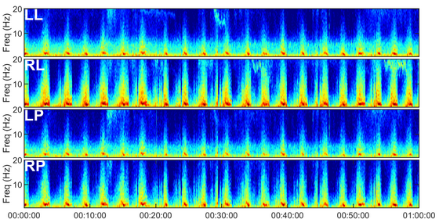

 

  <h3 align="center">Machine Learning in Practice (MLiP) </h3>
 

   <h4 align="center">HMS - Harmful Brain Activity</h4>

 

Classify seizures and other patterns of harmful brain activity in critically ill patients.

  
  <h5 align="center">
   MLiP Group 10
     
  </h5>
    

## Codebase

| Folder  | Description |
| ------------- | ------------- |
| `notebooks/data_exploration`  | This folder contains Kaggle notebooks used for data exploration.  |
| `notebooks/ensembles`  | Notebooks aimed to supply models we could use as ensembles.   |
| `notebooks/final_notebooks/creation`  |  Final notebooks that were used for creating datasets on Kaggle.  |
| `notebooks/final_notebooks/training`  |  Final notebooks that were used for training models on Kaggle.  |
| `notebooks/final_notebooks/inference`  |  Final notebooks that were used for submissions at Kaggle competition.   |
| `notebooks/model_testing`  | Notebooks used for testing models. |
| `datasets`  | Dataset objects used throughout the repository and configurations for it.  |
| `models`  | Model objects used throughout the repository and configurations for it.  |
| `generics.py`  | Generic variables and paths used throughout the repository.   |
| `main_*.py`  | Entry point main scripts for testing and using the codebase.   |